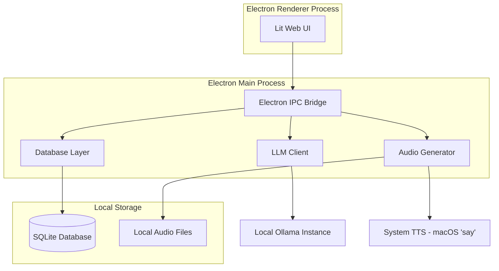

# Design Document

## Overview

The Local Language Learning App is an Electron-based (Node.js) desktop application that provides offline vocabulary learning through contextual sentences. The system integrates local LLM generation (via Ollama), SQLite persistence, system TTS, and a Lit-based web UI to create a privacy-focused learning environment that operates entirely without external dependencies.

## Architecture

### High-Level Architecture



### System Boundaries

- **Frontend Boundary**: Lit components communicate only through Electron IPC
- **Backend Boundary**: Main process handles all system interactions (DB, LLM, TTS)
- **External Boundary**: Only local Ollama HTTP endpoint (localhost:11434)
- **Storage Boundary**: SQLite database and local filesystem for audio files

## Components and Interfaces

### 1. Database Layer

**Responsibilities:**
- Manage SQLite connections and transactions
- Provide CRUD operations for words, sentences, and progress
- Handle schema migrations and data integrity

**Key Interfaces:**
```typescript
interface DatabaseLayer {
  // Word management
  insertWord(word: string, translation: string, audioPath: string): Promise<number>
  updateWordStrength(wordId: number, strength: number): Promise<void>
  markWordKnown(wordId: number, known: boolean): Promise<void>
  markWordIgnored(wordId: number, ignored: boolean): Promise<void>
  getWordsToStudy(limit: number): Promise<Word[]>
  
  // Sentence management
  insertSentence(wordId: number, sentence: string, translation: string, audioPath: string): Promise<number>
  getSentencesByWord(wordId: number): Promise<Sentence[]>
  
  // Progress tracking
  updateLastStudied(wordId: number): Promise<void>
  getStudyStats(): Promise<StudyStats>
}
```

**Database Schema:**
```sql
CREATE TABLE words (
  id INTEGER PRIMARY KEY AUTOINCREMENT,
  word TEXT NOT NULL,
  audio_path TEXT,
  translation TEXT NOT NULL,
  strength INTEGER DEFAULT 0,
  known BOOLEAN DEFAULT FALSE,
  ignored BOOLEAN DEFAULT FALSE,
  created_at DATETIME DEFAULT CURRENT_TIMESTAMP,
  last_studied DATETIME
);

CREATE TABLE sentences (
  id INTEGER PRIMARY KEY AUTOINCREMENT,
  word_id INTEGER REFERENCES words(id),
  sentence TEXT NOT NULL,
  translation TEXT NOT NULL,
  audio_path TEXT,
  created_at DATETIME DEFAULT CURRENT_TIMESTAMP
  last_shown DATETIME
);

CREATE TABLE progress (
  id INTEGER PRIMARY KEY AUTOINCREMENT,
  words_studied INTEGER DEFAULT 0,
  when_studied DATETIME
);
```

### 2. LLM Client

**Responsibilities:**
- Interface with local Ollama instance
- Generate topic-based vocabulary lists
- Create contextual sentences (and their translation) for vocabulary words

**Key Interfaces:**
```typescript
interface LLMClient {
  generateTopicWords(topic: string, language: string, count: number): Promise<GeneratedWord[]>
  generateSentences(word: string, language: string, count: number): Promise<GeneratedSentence[]>
}

interface GeneratedWord {
  word: string  // Foreign
  translation: string  // English
  frequency: 'high' | 'medium' | 'low'
}

interface GeneratedSentence {
  sentence: string  // Foreign
  translation: string  // English
}
```

**Prompt Templates:**
- **Topic Words**: "Generate {count} common spoken words about '{topic}' in {language}. Return JSON array with word, English translation, and frequency level."
- **Sentences**: "Create {count} natural, short spoken sentences in {language} using the word '{word}'. Include English translations. Return JSON array."

### 3. Audio Generator

**Responsibilities:**
- Generate TTS audio using system commands

**Key Interfaces:**
```typescript
interface AudioGenerator {
  generateAudio(text: string, language: string): Promise<string>  // Used for words and sentences.
}
```

**File Naming Convention:**
- Pattern: `audio/<text>.aiff`
- Example: `audio/apa_kabar.aiff`

### 4. UI Components (Lit)

**Component Hierarchy:**
```
app-root
├── learning-mode
│   ├── topic-selector
│   ├── word-viewer
│   ├── sentence-viewer
├── quiz-mode
│   ├── word-sentence-display
│   └── answer-buttons
└── progress-summary
```

**Key Component Interfaces:**
```typescript
// Main application state management
interface AppState {
  currentMode: 'learning' | 'quiz'
  selectedTopic?: string
  selectedWords?: Word[]
  quizDirection: 'foreign-to-english' | 'english-to-foreign'
}
```

### 5. IPC Bridge

**Responsibilities:**
- Expose secure APIs from main process to renderer
- Handle async communication between UI and backend services
- Validate and sanitize all cross-process data

**API Surface:**
```typescript
interface IPCBridge {
  // Database operations
  database: {
    insertWord: (word: CreateWordRequest) => Promise<number>
    updateWordStrength: (wordId: number, strength: number) => Promise<void>
    getWordsToStudy: (limit: number) => Promise<Word[]>
    // ... other database methods
  }
  
  // LLM operations
  llm: {
    generateWords: (topic: string?, language: string) => Promise<GeneratedWord[]>
    generateSentences: (word: string, language: string) => Promise<GeneratedSentence[]>
  }
  
  // Audio operations
  audio: {
    generateAudio: (text: string, language: string) => Promise<string>
    playAudio: (audioPath: string) => Promise<void>
  }
}
```

## Data Models

### Core Entities

```typescript
interface Word {
  id: number
  word: string
  language: string
  translation: string
  audioPath: string
  strength: number        // 0-100 scale
  known: boolean
  ignored: boolean
  createdAt: Date
  lastStudied?: Date
}

interface Sentence {
  id: number
  wordId: number
  sentence: string
  translation: string
  audioPath: string
  createdAt: Date
}

interface StudySession {
  selectedWords: Word[]
  currentIndex: number
  mode: 'learning' | 'quiz'
  quizDirection?: 'foreign-to-english' | 'english-to-foreign'
}

interface QuizQuestion {
  word: Word
  sentence: Sentence
  direction: 'foreign-to-english' | 'english-to-foreign'
}
```

### State Management

The application uses a simple state management pattern:
- **App-level state** stored in the root component
- **Component state** managed locally with Lit reactive properties
- **Persistent state** automatically synced to SQLite on changes
- **No external state management library** to maintain simplicity

## Error Handling

### Error Categories and Strategies

1. **LLM Communication Errors**
   - Retry with exponential backoff (max 3 attempts)
   - Fallback to cached content when available

2. **Audio Generation Errors**
   - Skip audio for problematic sentences
   - Continue with text-only mode
   - Log errors for debugging without blocking user flow

3. **Validation Errors**
   - Zod schema validation for all LLM responses
   - Type safety enforcement at compile time

### Error Recovery Patterns

```typescript
interface ErrorHandler {
  handleLLMError(error: LLMError): Promise<void>
  handleAudioError(error: AudioError): Promise<void>
  showUserError(message: string, recoverable: boolean): void
}
```

## Testing Strategy

### Integration Testing
- **LLM Client**: Use real Ollama responses and test parsing logic
- **End-to-End Learning Flow**: Topic selection → word selection → sentence review → quiz
- **Data Persistence**: Verify state preservation across app restarts
- **Audio Pipeline**: Test complete TTS generation and playback flow

### Testing Tools
- **Playwright** for E2E testing of Electron app
- **SQLite in-memory** databases for test isolation

## Security Considerations

### Data Privacy
- All user data remains on local device
- No telemetry or analytics collection
- SQLite database stored in user's application data directory

### Input Validation
- Validate all LLM responses against strict schemas
- Limit file system access to designated audio directory

### Process Isolation
- Renderer process runs in sandbox mode
- Main process handles all privileged operations
- IPC communication uses structured, validated messages

## Performance Optimization

### Caching Strategy
- **Sentence Cache**: Avoid regenerating identical content
- **Audio Cache**: Reuse existing TTS files
- **Database Indexing**: Optimize queries for word strength and last studied

### Resource Management
- **Lazy Loading**: Load sentences only when needed
- **Memory Management**: Clean up audio resources after playback
